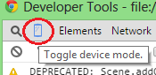
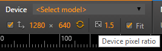
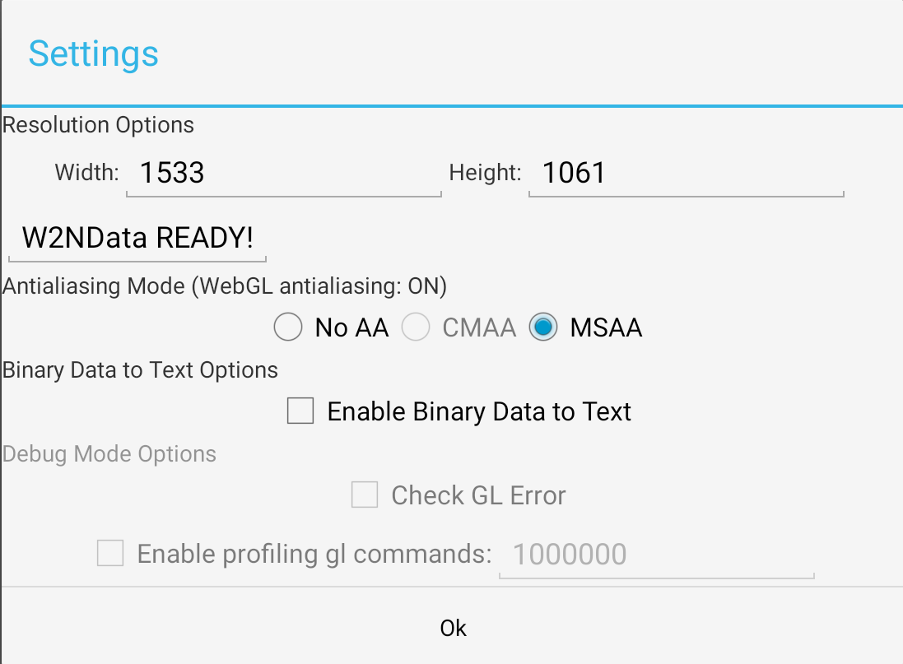
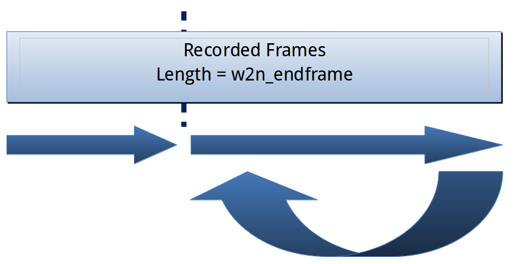
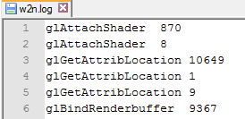

<h1 align = "center">User Guide of Application Convertor for WebGL*</h1>

## 1 Introduction

Application Convertor for WebGL* is a tool designed to translate WebGL into OpenGL ES2.0 application, and it help developers 
to optimize browser by finding the performance gap between WebGL workload and native workload. Here we use W2N for code name

### How it works

1. Record every WebGL command of the target WebGL workload by injecting js scripts to local WebGL workloads.
2. Save all the commands, variables and assets needed. Translate WebGL commands into OpenGL ES commands.
3. Generate C++ codes or W2NData file with those OpenGL commands and related variables.
4. Build the responding native workload and analyze it with other tools.

### Modes

W2N tool has two modes to run native workload: `Compiled` and `VM`.
-  In compiled mode, W2N tool will generate C++ files to run a specific workload.
-  In VM mode, W2N tool will generate a W2NData file. A W2N virtual Machine will read the W2NData file and then run the whole workload.

### Platforms

W2N tool can build native workloads of Android, ChromeOS and Linux.

Android supports Compiled and VM modes. ChromeOS/Linux now only support Compiled mode.

### Project structure

Source code layout in  folder.

```
Diretory
|--template\
|--GLEmulator\
|--w2n_android_project\               // project folder to build Android apk
|--w2n_gbm\                           // project folder to build CrOS/Linux binary
|--W2NData_generation_tool\
|--FileSaver.js
|--tool.js
|--w2n.py
```

## 2 Record WebGL commands

### Step 1: Prepare workload

*  We need the **offline** version of target WebGL workloads.
*  Copy the `tool.js` and `FileSaver.js` into the folder that contains the main html of the workload.
*  Add following two lines before any other `<script>` in the `<head>` tag.
   ```html
   <script type="text/javascript" src="tool.js"></script>
   <script type="text/javascript" src="FileSaver.js"></script>
   ```
*  Configuration

   In `tool.js`, two variables can be modified.

   ```javascript
   var w2n_endframe = 900;     // the number of the recorded frames
   var w2n_skipsearch = false; // whether merge the global variables with same value
   ```

   **Note**:

   *  If `w2n_endframe` is too high, the final compiling time will be long. 
   *  If `the w2n_skipsearch` is false, the variables with same value will be merged, which is useful for debugging, but the recording time will be long.

### Step 2: Prepare Chrome

*  Open Chrome browser with command line flag: `--allow-file-access-from-files`.
*  Change Chrome Setting: In chrome://settings/ -> show advanced settings -> privacy -> content settings -> automatic downloads, choose “allow all sites to download multiple files automatically”.
*  Press F12 and click the button of “toggle device mode” at the left-top corner of developer tool.

<div align="center">

</div>

*  After that, choose your device type or simply put the size and pixel ratio of your target device into the text boxes and refresh your page to start recording.

<div align="center">

</div>

　　If the target device is baytrail 8# pad, set the viewport size as `1280*640` (which are the `window.innerWidth` and `window.innerHeight` of the chrome on pad) and the pixel ratio as 1.5. And the size for Merrifield phone is `598*287`. You can check the pixel ratio with `window.devicePixelRatio`.

### Step 3: Record and dump files

*  Drag the main html file into chrome to run the workload. Make sure the Developer tools are undocked into a separate window. (Ensuring it will not affect the window size of the workload html.)

*  Wait until #w2n_endframe frames are recorded. When the recording is done, the webpage stops changing and console shows `W2N:RAF STOP`.

*  Execute `W2N.Dump()` in the console. The chrome starts to download many files, wait until the console shows `FINISH`.

If the total dumped files’ size exceeds 500MiB, the console will show error “blob size exceeds the max value!” and the chrome will stop downloading.

## 3. Build W2N native workload

### Build Android apk

#### 1. Set up NDK, SDK, Ant build environment

*  We need a Linux development machine
*  Install Android NDK and SDK.
*  Edit `w2n_android_project/local.properties` to set your NDK and SDK path.
   Example:
   ```
   sdk.dir=/home/your/Android/Sdk
   ndk.dir=/home/your/ndk/android-ndk-r10e
   ```
*  Export your NDK path to your $PATH environment variable
*  Install Ant build tools

#### 2. Generate Android project

*  Run python script `w2n.py`, pass a path of dump files as an argument (if no arguments, this script will use default download folder ~/Downloads/). This script will generate a new file named Android.mk and some cpp files in `w2n_android_project/jni/`.
   *  Build compile mode version: `./w2n.py --compiled [folder of dump files]`
   *  Build VM version: `./w2n.py --vm`

#### 3. Build apk

In the `w2n_android_project` dir, run `build.sh` to compile the native code and build APK. Or execute:

`ndk-build -j8 && ant debug`

Wait until the building is done. The Nativerunner-debug.apk file is in the bin folder.


**Note**

*  You should build the application very time when you have a different workload in compiled version and the first time when you use VM version.
*  In VM mode, we don't need dump files to make the whole application. The dump files will be converted into a binary data file W2NData containing OpenGL ES commands and APK can interpret this data file.
*  If you want to build a pure native app, open Android.mk and uncomment the last line of the Android.mk file.

### Build for ChromeOS/Linux

We build one native worklad that can run on both ChromeOS and Linux.

#### 1. Set up build environment

*  We need a Linux development machine (**Ubuntu 16.04 or higher**).
*  Install dependencies: `sudo apt-get install libgles2-mesa-dev libgbm-dev`
*  We also depend on skia, and provided a x64 libskia.a lib. We can also build skia from source.

#### 2. Generate the gbm project
*  We use GBM(Generic Buffer Management) and DRM(Direct Rendering Manager) modesetting with OpenGL ES for ChromeOS and Linux platform.
*  Run python script `w2n.py` with `--gbm`
   ```
   ./w2n.py --gbm [folder of dump files]
   ```

#### 3. Build
*  In the `w2n_gbm` folder:
   ```
   mkdir -p build;
   cd build
   cmake .. && make -j8
   ```

#### Build Skia Library
*  Download
   ```
   git clone 'https://chromium.googlesource.com/chromium/tools/depot_tools.git'
   export PATH="${PWD}/depot_tools:${PATH}"
   git clone https://skia.googlesource.com/skia.git
   cd skia
   python tools/git-sync-deps
   ```

*  Build
   ```
   bin/gn gen out/Release --args='is_debug=false
                                  skia_enable_discrete_gpu=false
                                  skia_enable_effects=false
                                  skia_enable_gpu=false
                                  skia_enable_jumper=false
                                  skia_enable_pdf=false
                                  skia_enable_tools=false
                                  skia_use_expat=false
                                  skia_use_fontconfig=false
                                  skia_use_icu=false
                                  skia_use_piex=false
                                  skia_use_zlib=false
                                  skia_use_system_freetype2=false'
   ninja -C out/Release libskia.a
   strip --strip-unneeded out/Release/libskia.a
   ```
*  Copy `skia/out/Release/libskia.a` to `w2n_gbm/lib/`

### Generate W2NData that used in VM mode(Only available for Android)

You need to convert dump files to W2NData in VM mode. A new W2NData is a new workload.
```
$ cd ./tool
$ make (optional, generate the tool first which can convert dump files into binary)
$ ./tool -- d2b [url of dump files]
$ adb push W2NData /sdcard/
```

If you want to build a W2N binary data for VM mode, you must also make the binary data config file.

### Note 

*  If you want to build with debug mode, modify W2NDEBUG to 1 in `template/gl_code.h`. It will enable debug mode for both native apk and pure native. In this mode we can print out all error information and enable profiling of the time usage of each gl command. However, the compiling time will be much longer.


## 4. Run W2N workload

### Android

*  Install. `adb install [path of the apk file]`

In VM mode, you should also push the W2NData to the sdcard.
```
$ cd ./tool
$ adb push W2NData /sdcard/
```

*  Run 

Open the app “NativeRunner” in the target device, type the desired resolution and press “Enter”. Then the native workload will run.

<div align="center">

</div>

Usually we don’t need to change the default resolution. MSAA option is used to force disable multi-sampling anti-aliasing.

Debug mode options will be enabled under debug mode, we can enable checking errors and profiling the time usage of gl commands if you want.

If you want export the W2NData’s command in GLEmulator version, you need to enable Binary Data to Txt. The file is in /sdcard/TxTData in android.

### ChromeOS

*  Connect CrOS device and your development machine in the same network. When using a wireless AP, make sure ChromeOS is still connected to it after user logout.
*  Copy `w2n_gbm/build/run/gl_code_main` and `w2n_gbm/lib/libstdc++.so.6.0.21` to `/tmp` on CrOS
   ```
   scp build/run/gl_code_main root@chromebook-ip:/tmp/
   scp lib/libstdc++.so.6.0.21 root@chromebook-ip:/tmp/
*  Connect to CrOS via SSH `ssh root@chomebook-ip`
*  Run with command (via ssh):
   ```
   stop ui (Chromebook screen will be turned off)
   LD_PRELOAD=./libstdc++.so.6.0.21 ./gl_code_main
   ```
*  Press Enter to Exit. `start ui` to restart the Chromebook UI.

### Linux

*  Go to tty1 with Ctrl + Alt + F1
*  Login and run `w2n_gbm/build/run/gl_code_main`
*  ress Enter to Exit. Ctrl + Alt + F7 to return GUI.

### Display

When we change the resolution of the native workload, we actually change the size of window, which determines the amount of the fragment and has influence on the performance. However, because some workloads have different viewport sizes and the tool do not know how to adjust these values, the all viewport sizes in the native workload are fixed as they were in the record step. After we change the window size, if the viewport size is larger than surfaceview size, we can only see part of the workload, otherwise, the workload occupies part of the window. Viewport only stretch or shrink the workload size, it does not affect the number of Open GL fragments.

We will loop the latter 2/3 recorded frames, because former 1/3 frames will do some initialization works.

<div align="center">

</div>

In some situations, native workload is played faster than WebGL version. That is because recoding WebGL commands may lower the FPS of the workload. The real interval between 2 sequential fames we recorded is more than 1/60s. When we play the frames with nearly 60Hz, the scenes move faster than usual.

## 5 Profile time usage

When we build our native app with debug mode (open the gl_code.h and set the macro W2NDEBUG as 1), we can start profiling the time usage of each gl command using two ways:
*  Enable profiling at the settings page of native apk.
*  Push a file name w2n.ini with “—log-gl-command-time 1000” to profile first 1000 commands. This works for both native apk and pure native version.

If you see “gl command time profiling finished” in adb logcat, the profiling process has finished. The dumped information will be written into /sdcard/w2n.log as below.

<div align="center">

</div>

The time used by each command is recorded in micro seconds.

## 6 Analysis the trace

We add a tool to analysis the trace of GLEmulator.
1. Capture the trace: external/chromium-trace/systrace.py -t 5 gfx -o ~/trace.html(the trace must include the init time ,so do this recording before you enter the application,or it will crash!)
2. Then $ ./tool -- analysis url
3. The analysis will do as follow:
setupGraphics time : 54.24ms
First 900 frames
average renderFrame time : 147.308ms
average eglSwapBuffers time : 3.14005ms
Next 600 frames
average renderFrame time : 12.579ms
average eglSwapBuffers time : 6.28555ms

## 7 Limitations

*  W2N tool cannot be used in the workload with multiple WebGL Canvases.
*  The workload has to animate frames with function “requestAnimationFrame” or “webkitRequestAnimationFrame”, instead of “setTimeout” or “setInterval”.
*  If the sum of downloaded files’ size exceeds about 500MiB, no more files can be downloaded. We have already report this issue on the chrome issue tracker. (Issue 375297: the total blobs' size cannot exceed about 500MiB).
*  Setting the app’s resolution will not change the object size in the workload, because there are multiple different viewport size in the code, and the tool do not know how to modify the values to fit the resolution.
